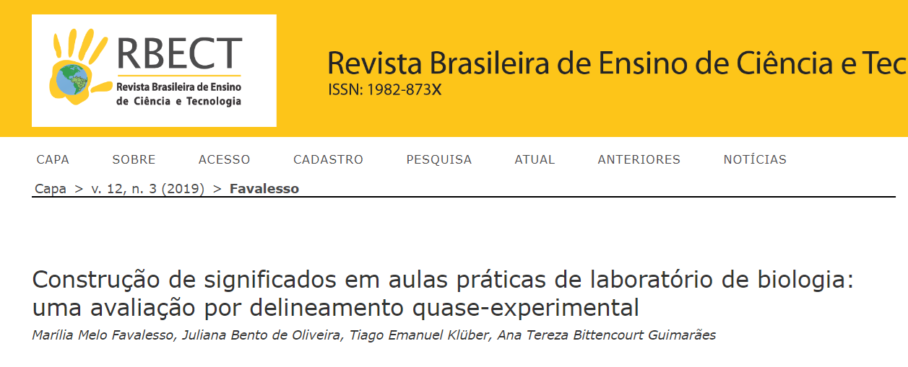

# Construção de significados em aulas práticas de laboratório de biologia

[](https://doi.org/10.3895/rbect.v12n3.7608)

## Autores
- Marília Melo Favalesso
- Juliana Bento de Oliveira
- Tiago Emanuel Klüber
- Ana Tereza Bittencourt Guimarães

## Resumo
O objetivo deste estudo foi avaliar a construção de conceitos biológicos quando os alunos são submetidos a atividades práticas em laboratório. Três turmas de ensino médio participaram (C, E1 e E2), sendo escolhidas sob critérios pré-definidos. E1 e E2 participaram de quatro diferentes aulas práticas em laboratório, enquanto a C apenas assistiu a aulas expositivas. Os grupos realizaram uma avaliação ao final de cada conteúdo abordado, sendo as correções realizadas por três diferentes avaliadores. Não houve diferenças significativas entre as notas dos avaliadores, indicando adequação nos critérios de avaliação inter-avaliadores. Quanto aos grupos, a análise descritiva revelou notas inferiores para o C quando comparado à E1 e E2. Pode-se concluir que as dimensões do ensino teórico não são isoladas do prático, mas que ambos são complementares ao outro, havendo sempre a construção dos conceitos quando ambos são ministrados de forma concomitante pelo professor de biologia.


## Arquivos
Este repositório contém os seguintes arquivos:

- `pibid.csv`: Dados das notas atribuídas pelos avaliadores.
- `pibidnf.csv`: Dados das notas por turma.
- `questionarios.csv`: Respostas dos questionários aplicados.
- `analise_paper.R`: Script R com a análise dos dados.
- `extras`: Diretório com outros materiais que foram utilizados durante o desenvolvimento do estudo. 

## Requisitos
Para executar os scripts R, você precisará ter as seguintes bibliotecas R instaladas:

```r
install.packages(c("plyr", "car", "dunn.test", "graphics", "ggplot2", "gridExtra", "grid", "scales"))
```

## Contato
Se você tiver dúvidas ou sugestões, sinta-se à vontade para entrar em contato: mariliabioufpr@gmail.com.

## DOI
[10.3895/rbect.v12n3.7608](https://doi.org/10.3895/rbect.v12n3.7608)
```

